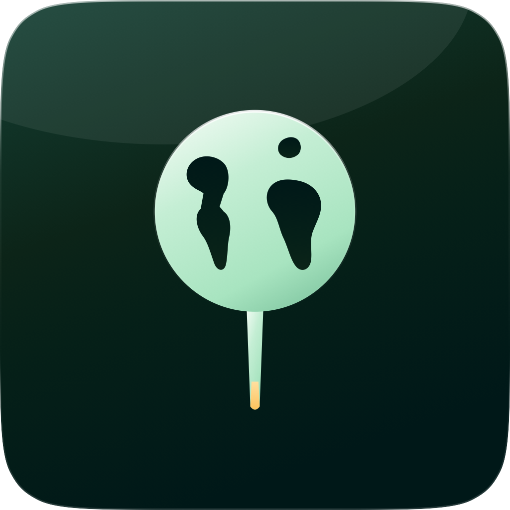

<p align="center">
  
</p>

<h1 align="center">PinAnyApp</h1>

<p align="center">
  
</p>

<p align="center">
  
  
  
</p>

PinAnyApp is a native menu-bar utility that turns any open window into a floating, always-on-top preview. Pick a window with the macOS system picker, place it where you need it, and keep the important parts of your workspace in sight.

> [!NOTE]
> PinAnyApp is currently in alpha development. Builds are intended for testing and may change without notice.

<p align="center"><a href="https://github.com/Salazar-Prime/PinAnyApp/releases/tag/v0.5.0-alpha.1">Download PinAnyApp v0.5.0 alpha</a></p>

## Preview

<!-- Add the UI walkthrough here when it is ready:
<p align="center">
  
</p>
-->

_UI walkthrough coming soon._

## Features

- Pin up to 12 windows at once
- Keep previews floating above other windows
- Show previews on the current Space or every Space
- Hide, restore, and close each preview independently
- Include or exclude the pointer from captured content
- Choose Low, Standard, or High resolution per preview
- Crop a preview to only the portion of the source window you need
- Select windows through Apple's privacy-preserving system picker

## How it works

PinAnyApp uses ScreenCaptureKit to mirror the window you select into a lightweight floating panel. macOS remains in control of window selection and screen-recording permission.

Previews are intentionally view-only. Mouse clicks, keyboard input, and other interactions continue to belong to the original application.

To pin only part of a window, open the crop menu beside its preview, choose **Select Area…**, drag over the live image, and choose **Use Area**. Choose **Show Full Window** from the same menu to remove the crop.

## Requirements

- macOS 14 Sonoma or newer
- Xcode 16.2 or newer to build from source

Alpha builds are ad-hoc signed and not yet Apple-notarized. On first launch, macOS may require you to Control-click PinAnyApp and choose **Open**.

## Development

Once the source is published, open `Package.swift` in Xcode and run the `PinAnyApp` scheme, or use the command line:

```sh
swift build
swift test
make run
```

The packaged app is written to `.build/PinAnyApp.app`.

## Privacy

PinAnyApp uses public macOS APIs and does not synthesize input. Window capture is subject to macOS Screen Recording permission, and the system window picker always makes the selected content explicit.
